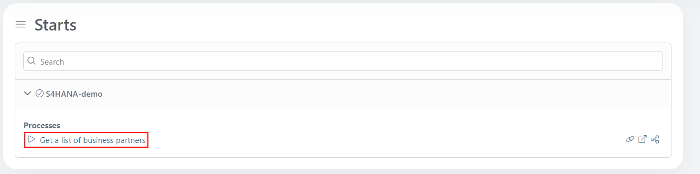
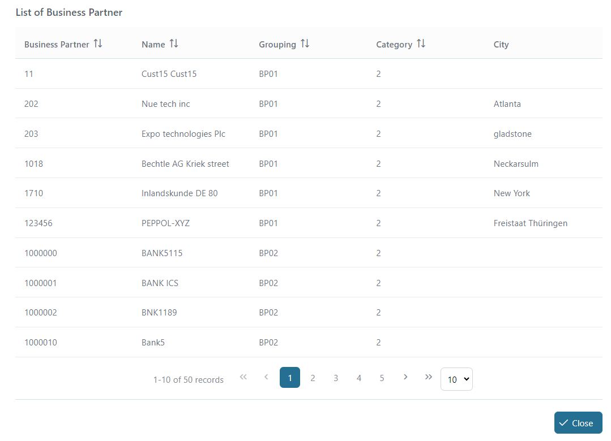

# SAP S/4HANA

The SAP S4/HANA connector easily connects to a SAP S/4HANA database. This connector:

- Focuses on the business partner domain
- Establishes a connection to its database to show all business partners together with their email addresses
- Needs a tryout account for the [SAP Demo API](https://api.sap.com/api/API_BUSINESS_PARTNER/tryout)
- Supports you with an easy-to-copy demo implementation to reduce your integration effort

## Demo

This demo example connects to the database of all business partners in SAP S/4HANA.

1. Start the process "Get list of business partners"

2. A list of business partners are displayed in the table


## Setup

1. Set up a test environment for SAP S/4HANA Business Partner API to get an account containing the host(baseUrl), username, and password.

2. Set the global variables to SAP's needs. You may need to add a certificate to connect to SAP via SSL.
Add the following `Variables` to your `variables.yaml`:

- `Variables.s4HanaConnector.baseUrl`
- `Variables.s4HanaConnector.username`
- `Variables.s4HanaConnector.password`

and replace the values with your given setup.

```
@variables.yaml@
```

