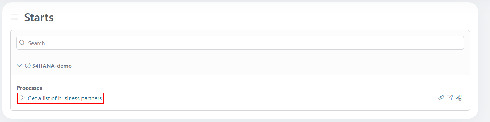
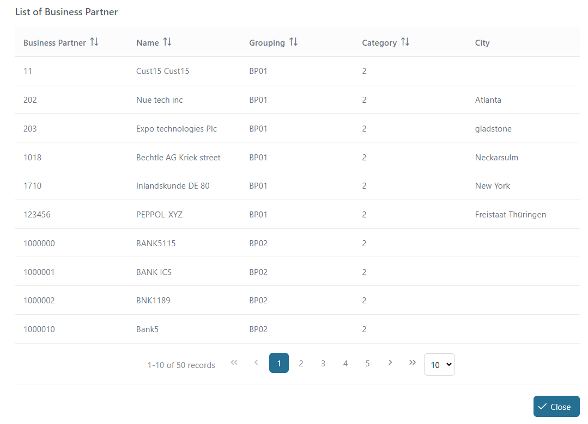

# S4HANA

This connector shows an easy way to connect to the SAP S4HANA database. 

The focus here is on the business partner domain. In the example, a connection to the database is established and all business partners are listed together with their email addresses.
Please note: In the example, a connection to [SAP Demo API](https://api.sap.com/api/API_BUSINESS_PARTNER/tryout) is established, i.e. it is necessary that you first create an account here.


## Demo

Demo tries to connect to SAP and gets list of business partners
1. Start Process to get a list of business partners

2. List of business partners are displayed in the table


## Setup

1. Setup Environment for S/4HANA Business Partner API to get an account that contains host(baseUrl), username and password to use.

2. Please set the global variables to the SAP needs. Maybe you need to add a certificate to connect to SAP via SSL.
Add the following `Variables` to your `variables.yaml`:

- `Variables.s4HanaConnector.baseUrl`
- `Variables.s4HanaConnector.username`
- `Variables.s4HanaConnector.password`

and replace the values with your given setup.

```
@variables.yaml@
```

