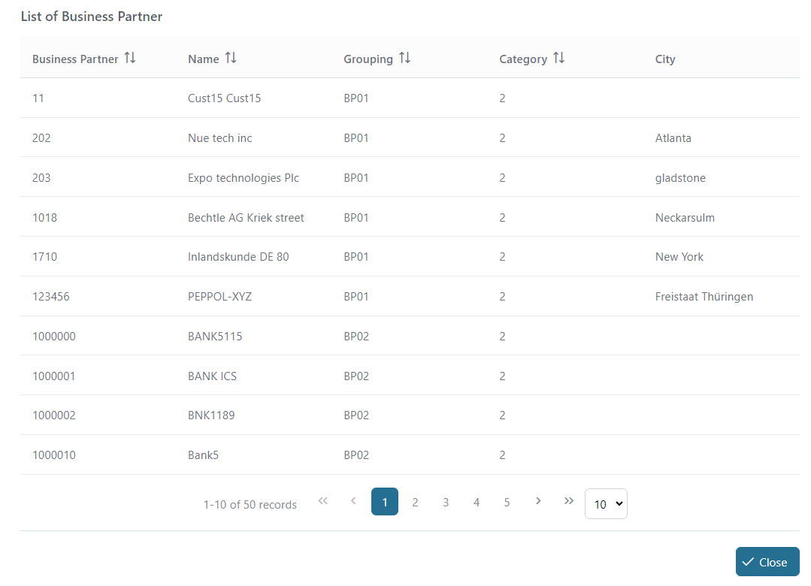

# SAP S/4HANA

Dieser Konnektor verbindet die Axon Ivy Engine ohne viel Aufwand mit einer SAP S/4HANA-Datenbank - mit Fokus auf den Bereich der Business Partner.

Dieser Konnektor:
- stellt eine Verbindung zur Datenbank her, um alle Business Partner und ihre E-Mail-Adressen anzuzeigen
- benötigt ein Testkonto für die SAP Demo API
- unterstützt dich mit einer Demo-Implementierung, um deinen Integrationsaufwand zu reduzieren

## Demo

This demo example connects to the database of all business partners in SAP S/4HANA.

1. Start the process "Get list of business partners"

2. A list of business partners are displayed in the table


## Setup

1. Set up a test environment for SAP S/4HANA Business Partner API to get an account containing the host(baseUrl), username, and password.

2. Set the global variables to SAP's needs. You may need to add a certificate to connect to SAP via SSL.
Add the following `Variables` to your `variables.yaml`:

- `Variables.s4HanaConnector.baseUrl`
- `Variables.s4HanaConnector.username`
- `Variables.s4HanaConnector.password`

and replace the values with your given setup.

```
@variables.yaml@
```


