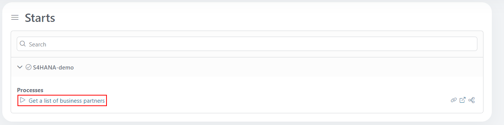

# SAP S/4HANA

Dieser Konnektor verbindet die Axon Ivy Engine auf einfache Weise mit einer SAP
S/4HANA-Datenbank – mit Schwerpunkt auf dem Bereich Geschäftspartner.

Dieser Konnektor:
- Stellt eine Verbindung zur Datenbank her, um alle Geschäftspartner und deren
  E-Mail-Adressen anzuzeigen.
- benötigt ein Testkonto für die SAP Demo API
- unterstützt Sie mit einer Demo-Implementierung, um Ihren Integrationsaufwand
  zu reduzieren.

## Demo

Dieses Demo-Beispiel stellt eine Verbindung zur Datenbank aller Geschäftspartner
in SAP S/4HANA her.

1. Starten Sie den Prozess „Liste der Geschäftspartner abrufen“
   
2. Eine Liste der Geschäftspartner wird in der Tabelle angezeigt!
   [list-of-business-partners](images/list-of-business-partners.png)

## Setup

1. Richten Sie eine Testumgebung für die SAP S/4HANA Business Partner API ein,
   um ein Konto mit Host (baseUrl), Benutzername und Passwort zu erhalten.

2. Legen Sie die globalen Variablen entsprechend den Anforderungen von SAP fest.
   Möglicherweise müssen Sie ein Zertifikat hinzufügen, um über SSL eine
   Verbindung zu SAP herzustellen. Fügen Sie die folgenden Variablen „ `”` zu
   Ihren Variablen „ `” variables.yaml` hinzu:

- `Variablen.s4HanaConnector.baseUrl`
- `Variablen.s4HanaConnector.Benutzername`
- `Variablen.s4HanaConnector.Passwort`

Ersetzen Sie die Werte durch Ihre angegebenen Einstellungen.

```
@variables.yaml@
```

